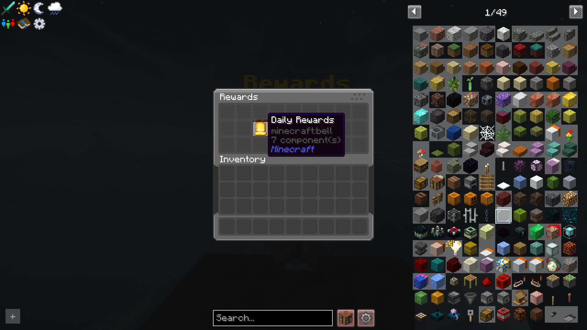
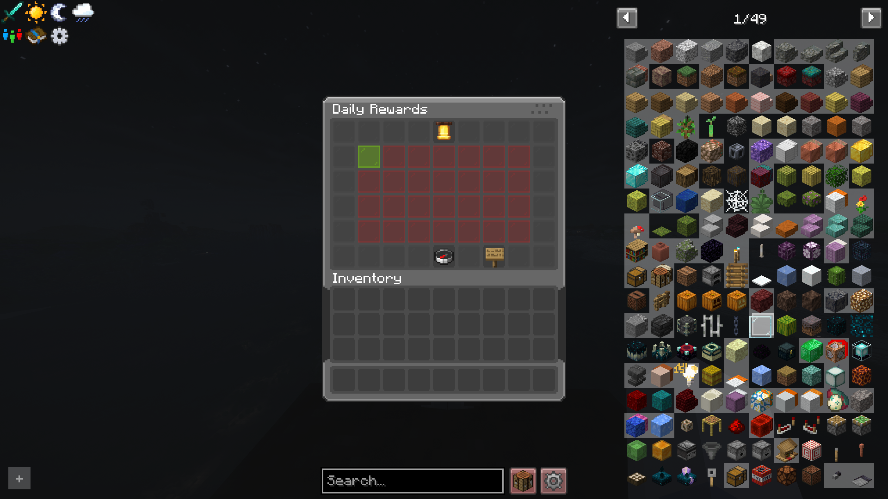
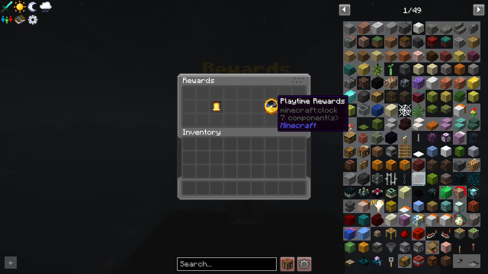
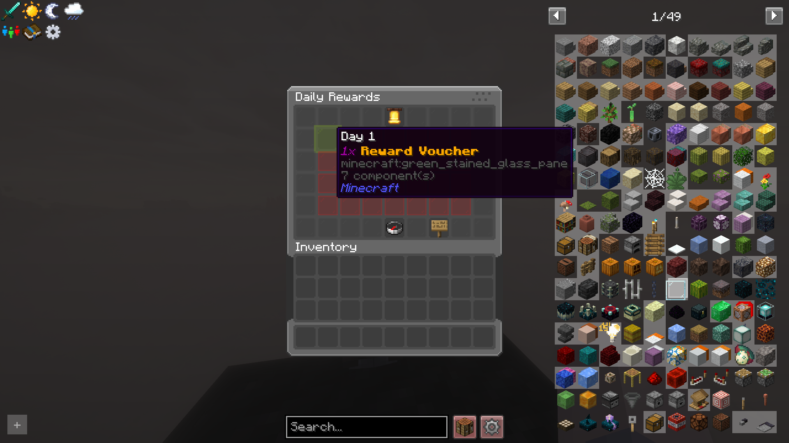
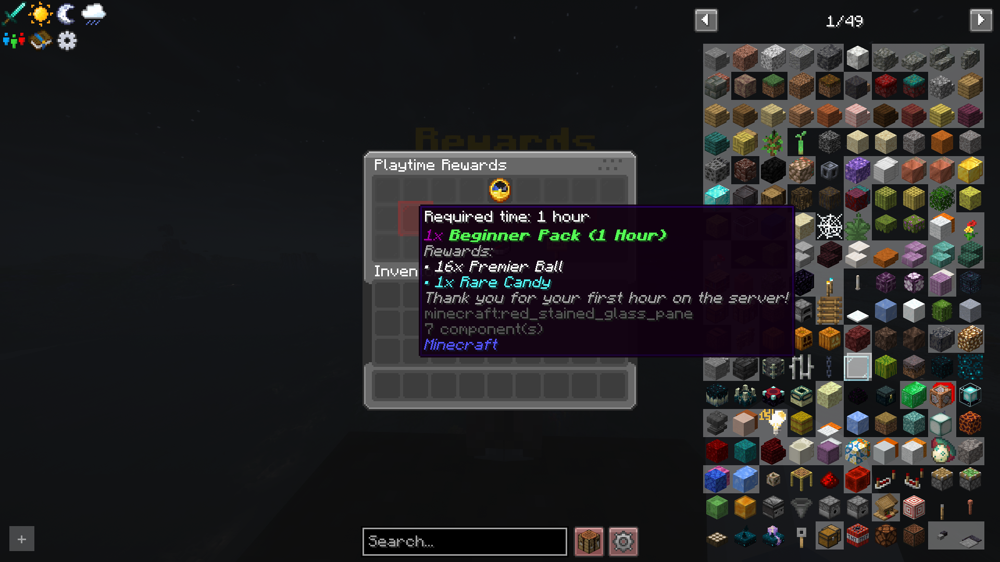
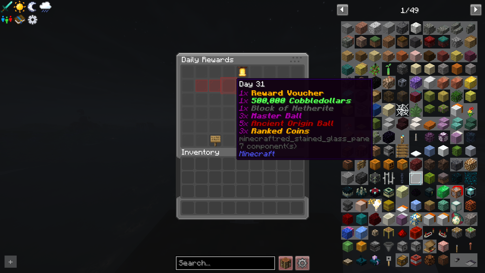
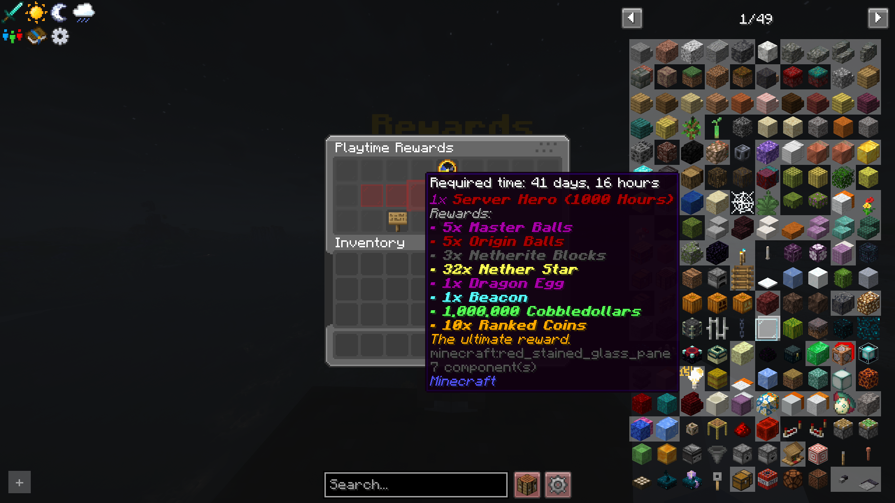
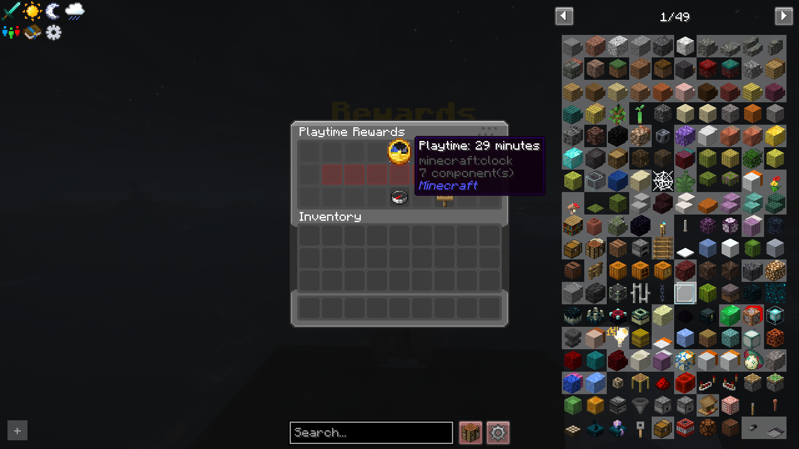
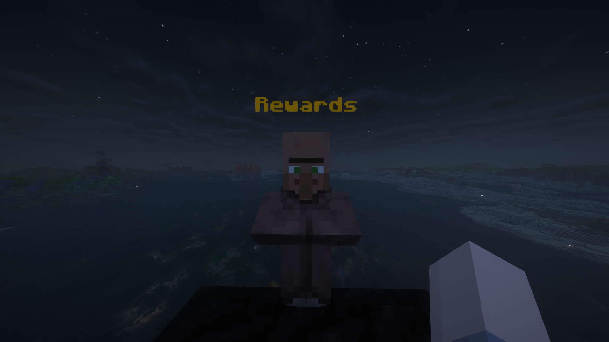

# Universal Daily Rewards

    [](https://github.com/SrKalopsia/Universal-Daily-Rewards-Fabric/actions/workflows/build.yml)

This release marks a complete evolution and total overhaul from the original `daily-rewards-fabric` mod. Formerly known as Cobbleverse Daily Rewards, version 4.0.0 introduces a universal architecture designed for any Minecraft server.

[](https://modrinth.com/mod/universal-daily-rewards) [](https://www.curseforge.com/minecraft/mc-mods/universal-daily-rewards) [](https://github.com/SrKalopsia/universal-daily-rewards-fabric)

**Universal Daily Rewards** is a 100% standalone, server-side mod that provides a highly configurable rewards system with native localization and a powerful template engine.

📖 **[Click here to read the full CHANGELOG](CHANGELOG.md)**

### ✨ Key Features (v4.0.0+)

* 🚀 **100% Server-Side:** No client-side installation required. Powered by **Polymer**.
* 🌍 **Native Localization (i18n):** Automatically adapts to the player's client language using **Server Translations API**.
  * Currently supports **English**, **Spanish** (multiple variants), and now **Korean** natively.
  * Other languages will default to English.
  * 🤝 **Contributions Welcome:** If you'd like to help translate the mod into your language, feel free to open a Pull Request on our GitHub!
* 📋 **Template System:** Quickly switch between reward sets using the `/rewards-setup load` command. It automatically detects any templates (including your own!) placed in the `config/rewards/templates/` folder.
* 🔄 **Looping Streaks:** Configure your daily rewards once and let them cycle automatically.
* 🕒 **Dynamic Cooldowns:** Real-time "Available in: Xh Ym" timers in GUI tooltips.
* 🖥️ **Remote Access:** Players can open the rewards menu using `/daily` (configurable in `global.json`).
* ⚙️ **Universal i18n Templates:** Default templates now use Minecraft `translate` keys, ensuring rewards names are localized in the player's language.

### 🛠️ Commands

#### Player Commands

* `/daily` - Opens the rewards selection menu (if enabled in config).
* `/rewards open` - Alias for `/daily`.

#### Admin Commands (Permission Level 2+)

* `/rewards-reload-<type>-config` - Hot-reload specific configurations.
* `/rewards-check <player>` - Check current streak and playtime stats for a player.
* `/rewards-force-save` - Forcefully save all player data to disk immediately.
* `/rewards-reset <player>` - Reset all progress for a player.
* `/rewards-setstreak <player> <days>` - Adjust daily login streak.
* `/rewards-setplaytime <player> <seconds>` - Adjust tracked playtime.
* `/rewards-screen-entity <add|remove> <entity>` - Bind the menu to physical NPCs.

#### Setup Commands (Permission Level 4)

* `/rewards-setup load <template>` - Apply a pre-made template (`vanilla`, `economy`, `cobbleverse`).
* `/rewards-setup allow-player-command <true|false>` - Toggle remote access via `/daily`.

## 📸 Gallery / In-Game Media

<table align="center" style="border-collapse: collapse; border: none; width: 100%;">
  <tr style="border: none;">
    <td align="center" style="border: none; padding: 10px; width: 33%; vertical-align: top;">
      <br>
      <strong>Selection Menu</strong><br>
      <small>The entry screen allowing players to choose between Daily and Playtime rewards.</small>
    </td>
    <td align="center" style="border: none; padding: 10px; width: 33%; vertical-align: top;">
      <br>
      <strong>Daily Calendar</strong><br>
      <small>Dynamic 28-day grid that automatically adapts to the number of configured daily rewards.</small>
    </td>
    <td align="center" style="border: none; padding: 10px; width: 33%; vertical-align: top;">
      <br>
      <strong>Playtime Rewards</strong><br>
      <small>Clean listing of playtime milestones with real-time tracking.</small>
    </td>
  </tr>
</table>

<h3 align="center">🎁 Reward Tooltips & Cooldowns</h3>

<table align="center" style="border-collapse: collapse; border: none; width: 100%;">
  <tr style="border: none;">
    <th align="center" style="border: none; padding: 5px; width: 50%;">Daily Login Rewards</th>
    <th align="center" style="border: none; padding: 5px; width: 50%;">Playtime Milestone Rewards</th>
  </tr>
  <tr style="border: none;">
    <td align="center" style="border: none; padding: 10px; vertical-align: top;">
      <br>
      <small><strong>Day 1 (Claimable):</strong> Shows preview of reward items.</small>
    </td>
    <td align="center" style="border: none; padding: 10px; vertical-align: top;">
      <br>
      <small><strong>1 Hour (Locked):</strong> Displays as locked glass pane.</small>
    </td>
  </tr>
  <tr style="border: none;">
    <td align="center" style="border: none; padding: 10px; vertical-align: top;">
      <br>
      <small><strong>Day 31 (Locked):</strong> Shows active cooldown and time remaining.</small>
    </td>
    <td align="center" style="border: none; padding: 10px; vertical-align: top;">
      <br>
      <small><strong>1000 Hours (Locked):</strong> Tooltip preview for locked high-tier milestone.</small>
    </td>
  </tr>
  <tr style="border: none;">
    <td align="center" style="border: none; padding: 10px; vertical-align: top;" colspan="2">
      <br>
      <small><strong>Total Playtime Status:</strong> Hover over the clock in-game to see your exact active playtime tracker.</small>
    </td>
  </tr>
</table>

<h3 align="center">👤 Physical NPCs Binding</h3>

<p align="center">
  <br>
  <em>Bind your rewards menu directly to any physical entity or NPC in the game world with <code>/rewards-screen-entity add <entity></code></em>
</p>

## ⚙️ Configuration & Flexibility

The mod uses an intuitive JSON structure that offers total freedom in how you distribute rewards. You can choose between two main methods (or mix them):

### 1. Command-Based Rewards (Recommended for Economy/Virtual Items)

Ideal for currency, permissions, or custom items with complex NBT. You run a command in the background and use a visual placeholder in the GUI.

* Set `"give_item": false` so the GUI item only acts as a visual icon.
* Add your commands to the `"commands"` array.

### 2. Direct Physical Rewards

The mod directly gives the player the physical item shown in the GUI.

* Set `"give_item": true`.
* The player will receive exactly what they see (amount, enchants, name, lore).

### Configuration Example

The following example contrasts **Command vs. Direct** rewards (Day 1) and **Text vs. Translate** names (Day 2):

```json
[
  {
    "day": 1,
    "id": "day_1",
    "commands": ["experience add %player% 500 points"],
    "items": [
      {
        "item": "minecraft:experience_bottle",
        "name": "{\"text\":\"500 XP Points (Command)\",\"color\":\"green\"}",
        "amount": 1,
        "give_item": false
      },
      {
        "item": "minecraft:diamond",
        "name": "{\"translate\":\"item.minecraft.diamond\",\"color\":\"aqua\"}",
        "amount": 3,
        "give_item": true
      }
    ]
  },
  {
    "day": 2,
    "id": "day_2",
    "items": [
      {
        "item": "minecraft:iron_sword",
        "name": "{\"text\":\"Custom Slayer Sword\",\"color\":\"red\",\"bold\":true}",
        "amount": 1,
        "give_item": true
      },
      {
        "item": "minecraft:golden_apple",
        "name": "{\"translate\":\"item.minecraft.golden_apple\",\"color\":\"gold\"}",
        "amount": 5,
        "give_item": true
      }
    ]
  }
]
```

> ### 💡 Want to see more full examples?
>
> You can explore the complete code for all our pre-made templates directly on our GitHub repository.
>
> 📁 **[Browse the Templates Folder](https://github.com/SrKalopsia/universal-daily-rewards-fabric/tree/main/src/main/resources/config/templates)**
>
> * [Vanilla Daily Config](https://github.com/SrKalopsia/universal-daily-rewards-fabric/blob/main/src/main/resources/config/templates/vanilla_daily.json)
> * [Vanilla Playtime Config](https://github.com/SrKalopsia/universal-daily-rewards-fabric/blob/main/src/main/resources/config/templates/vanilla_playtime.json)
> * [Economy Daily Config](https://github.com/SrKalopsia/universal-daily-rewards-fabric/blob/main/src/main/resources/config/templates/economy_daily.json)
> * [Economy Playtime Config](https://github.com/SrKalopsia/universal-daily-rewards-fabric/blob/main/src/main/resources/config/templates/economy_playtime.json)
> * [Cobbleverse Daily Config](https://github.com/SrKalopsia/universal-daily-rewards-fabric/blob/main/src/main/resources/config/templates/cobbleverse_daily.json)
> * [Cobbleverse Playtime Config](https://github.com/SrKalopsia/universal-daily-rewards-fabric/blob/main/src/main/resources/config/templates/cobbleverse_playtime.json)

### 🎨 Creating Custom Templates

You can easily create your own reward presets. The mod will automatically detect them as long as you follow these steps:

1. Navigate to your server's `config/rewards/templates/` folder.
2. Create two JSON files with the same prefix:
   * `yourname_daily.json` (for Daily Rewards)
   * `yourname_playtime.json` (for Playtime Rewards)
3. Use the `/rewards-setup load yourname` command in-game. The mod will find your files and apply them instantly!

## 📜 Credits

This project is an overhauled fork of the original [Daily-Rewards-Fabric](https://github.com/SmugTheKiler/daily-rewards-fabric) by SmugTheKiler. Huge thanks to them for laying the foundation!
